```{r setup, include=FALSE}
options(htmltools.dir.version = FALSE)
```


# Acknowledgements
This visit takes place within the scope of the Invited Researcher initiative of the Statistics and Risk Management group of CMA. It  is funded by national funds through the FCT - Fundação para a Ciência e a Tecnologia, I.P., under the scope of the project UIDB/00297/2020 (Center for Mathematics and Applications).

.pull-left[


]

.pull-right[


]


---
# About me 


---
class: inverse, center, middle

# Quantitative Genetics

--

Analysis of complex or multifactorial traits 

--

All genes affect all traits - the question is by how much?

--

Infinitesimal model

--

Quasi-infinitesimal model, Oligogenic model


---

# What is quantitative genetics?

--

Population genetics
- **Mathematics** is language of population genetics, **population genetics** is language of **evolution**.

--

Quantitative genetics 
- **Statistics** is language of quantitative genetics, **quantitative genetics** is language of **complex trait genetics**. 

--

**Phenotypes** first in quantitative genetics

In the era of genomics, phenotype is **king**


<center>
<iframe src="https://giphy.com/embed/9ADoZQgs0tyww" width="400" height="200" frameBorder="0" class="giphy-embed" allowFullScreen></iframe><p><a href="https://giphy.com/gifs/obama-awesome-statistics-9ADoZQgs0tyww">via GIPHY</a></p>
</center>


---

# Regression model
Galton (1886). Regression towards mediocrity in hereditary stature
"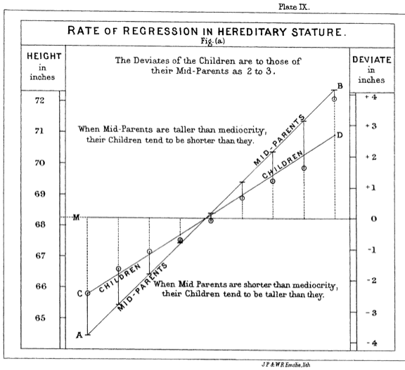


---

# Genome to Phenome
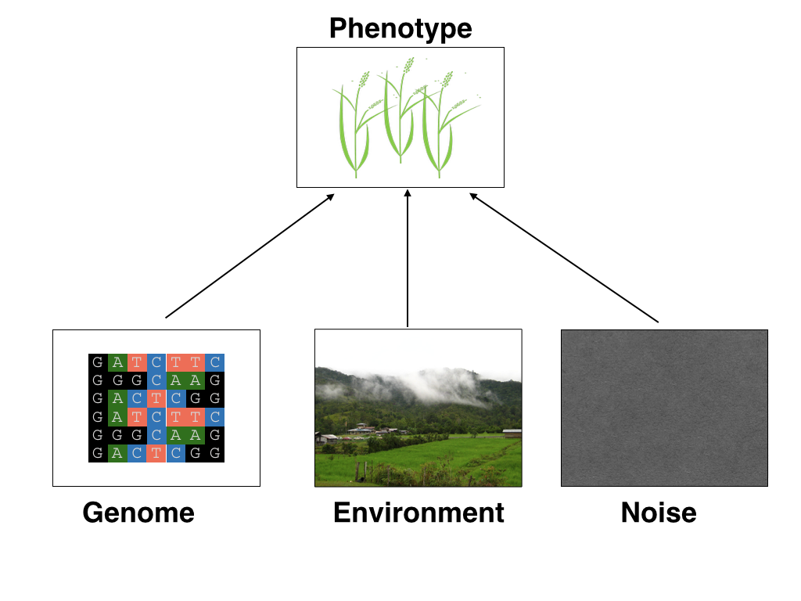


---
# Genetic values
Quantitative genetic model:

\begin{align*}
\mathbf{y} &= \mathbf{g} + \boldsymbol{\epsilon} \\
\end{align*}
where $\mathbf{y}$ is the vector of observed phenotypes, $\mathbf{g}$ is the vector of genetic values, and $\boldsymbol{\epsilon}$ is the vector of residuals. 

Example:

| Plant ID   | y           | g  |   e  |
| ------------- |:-------------:| -----:|------|
| 1      | 10 | ? |  ?     |
| 2      |  7     |   ? |  ?    |
| 3 | 12     |    ? |    ? |


---
# Genetic values
Quantitative genetic model:

\begin{align*}
\mathbf{y} &= \mathbf{g} + \boldsymbol{\epsilon} \\
\end{align*}
where $\mathbf{y}$ is the vector of observed phenotypes, $\mathbf{g}$ is the vector of genetic values, and $\boldsymbol{\epsilon}$ is the vector of residuals. 

Example:

| Plant ID    | y           | g  |   e  |
| ------------- |:-------------:| -----:|------|
| 1      | 10 | 5 |  5     |
| 2      |  7     |   6 |  1    |
| 3 | 12     |    2 |    10 |


--

Phenotypes can be observed and measured but genotypic and additive genetic effects cannot


---
# Conventional Phenotyping
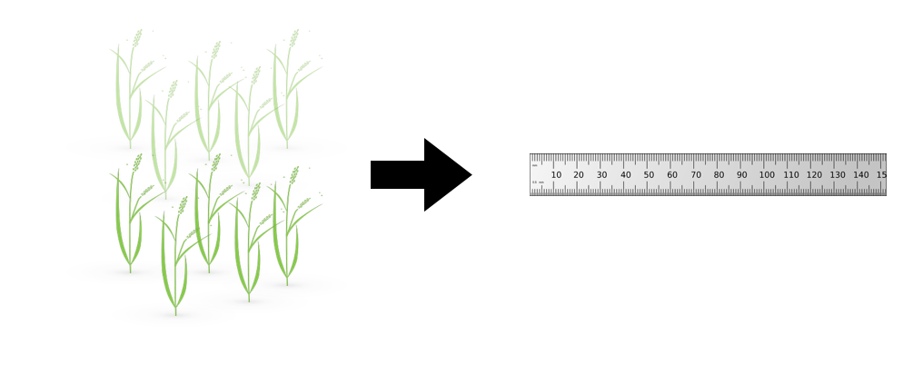

.pull-left[
- labor intensive

- time consuming
]

.pull-right[
<iframe src="https://giphy.com/embed/Jk4ZT6R0OEUoM" width="500" height="160" frameBorder="0" class="giphy-embed" allowFullScreen></iframe><p><a href="https://giphy.com/gifs/Jk4ZT6R0OEUoM">via GIPHY</a></p>
]

---
# Big genomic data (e.g., single nucleotide polymorphisms)


.center[Repeat of numbers 0, 1, and 2]


---
# Why we need big genomic data? (Makowsky et al., 2011)
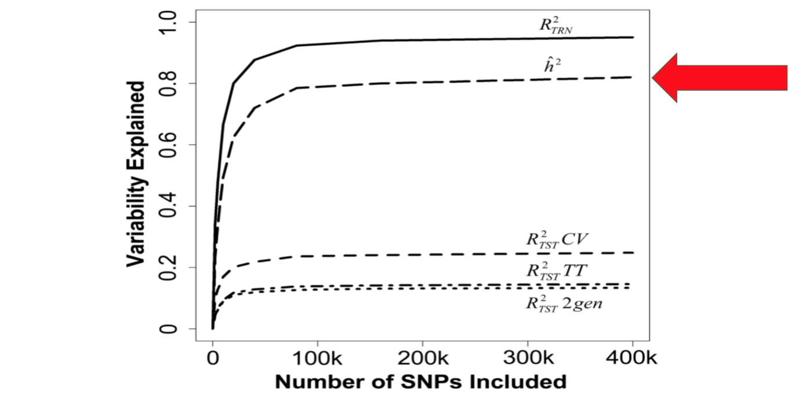


---
# Quantitative genetics
Connecting phenotypic data with genomic information<center>
<div>
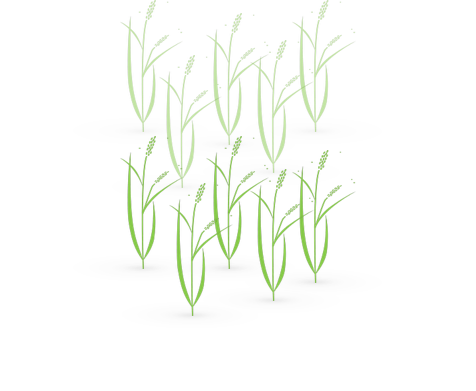
=
 + error 
</div>
</center>
\begin{align*}
\mathbf{y} &= \mathbf{g} + \boldsymbol{\epsilon} \\
 &\approx \mathbf{W}\mathbf{a} + \boldsymbol{\epsilon} 
\end{align*}
We approximate unknown $\mathbf{g}$ with $\mathbf{Wa}$. 
\begin{align*}
\underbrace{\begin{bmatrix}    
y_1\\
y_2\\
\vdots \\
y_n\end{bmatrix}}_{n \times 1}  
&= \underbrace{\begin{bmatrix}
   w_{11} & w_{12} & \cdots & w_{1m} \\
    w_{21} & w_{22} & \cdots & w_{2m} \\
    \vdots & \vdots & \ddots & \vdots \\
    w_{n1} & w_{n2} & \cdots & w_{nm}
\end{bmatrix}}_{n \times m} \quad
\underbrace{\begin{bmatrix}
a_1\\
a_2\\
\vdots \\
a_m\end{bmatrix}}_{m \times 1} 
+\underbrace{\begin{bmatrix}
\epsilon_1\\
\epsilon_2\\
\vdots \\
\epsilon_m\end{bmatrix}}_{n \times 1} 
\end{align*}

where $n$ is the number of individuals (e.g., accessions) and $m$ is the number of SNPs. 


---
# Quantitative Genetics
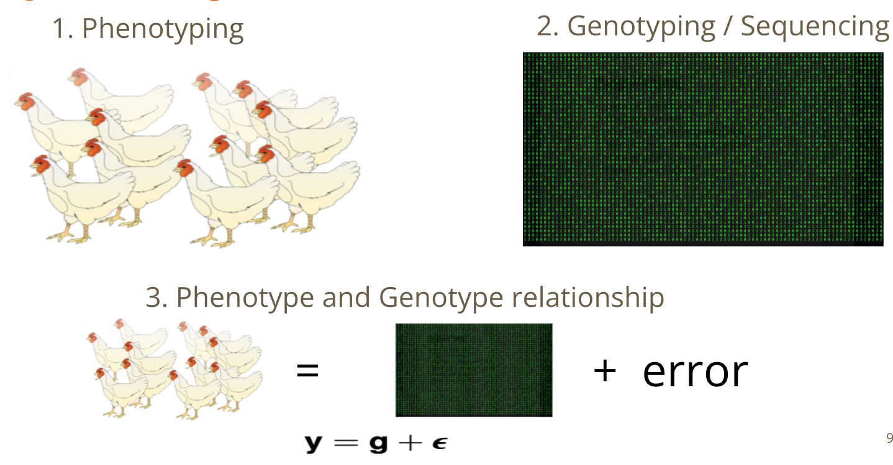

---
# Substantial reductions in the cost of genome sequencing
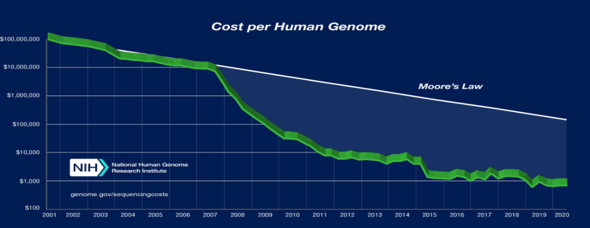

.center[Genotyping is a way cheaper than sequencing]


---
# Phenotyping is more expensive than genotyping
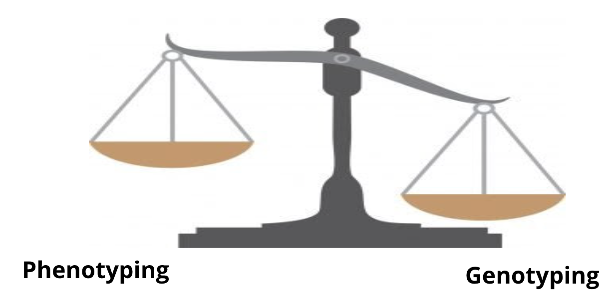

---
# Why we need more phenotyped individuals? (Erbe et al., 2013)
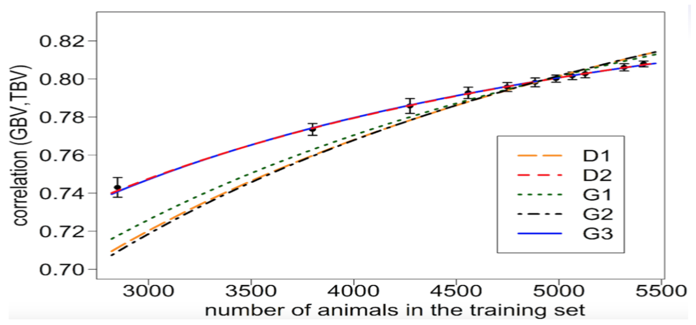


---
# Precision agriculture using advanced technologies
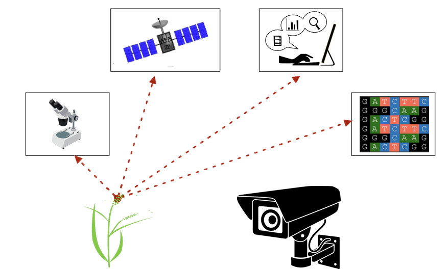


---
# Precision (digital) phenotyping
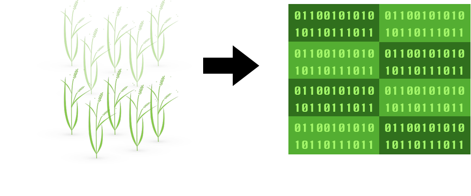


.pull-left[
- automated process

- less labor intensive

- less prone to measurement error
]

.pull-right[
<iframe src="https://giphy.com/embed/wW95fEq09hOI8" width="400" height="160" frameBorder="0" class="giphy-embed" allowFullScreen></iframe><p><a href="https://giphy.com/gifs/chihuahua-funny-cute-wW95fEq09hOI8">via GIPHY</a></p>
]


---
# Image-based High-Throughput Phenotyping (HTP)
.pull-left[
<iframe src="greenhouse-innovation-center.mp4" width="500" height="400" frameBorder="0" class="giphy-embed" allowFullScreen></iframe>

UNL Greenhouse Innovation Center 
]


.pull-right[
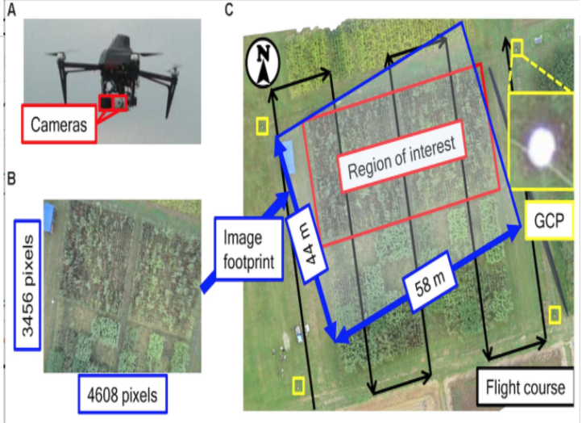

Unoccupied aerial vehicle (Watanabe et al. 2017)
]


---
# UNL Greenhouse Innovation Center 
<iframe width="660" height="515" src="https://www.youtube.com/embed/JWNoQ3w-KbY" title="YouTube video player" frameborder="0" allow="accelerometer; autoplay; clipboard-write; encrypted-media; gyroscope; picture-in-picture" allowfullscreen></iframe>


---
# A low-cost greenhouse-based HTP
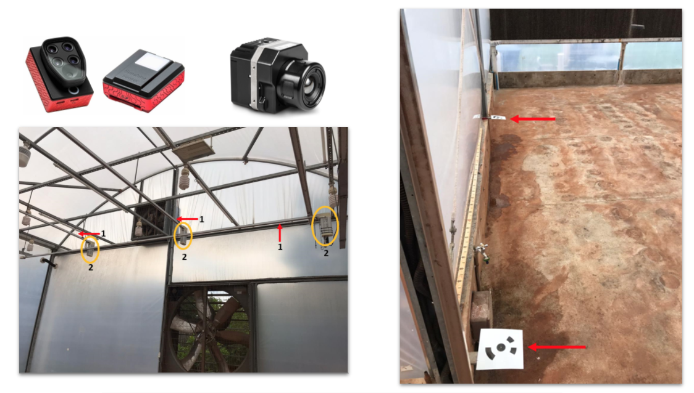
Multispectral and thermal camera, HTP platform, and ground control points ([Yassue et al. 2021](https://doi.org/10.1101/2021.08.12.456112)). 


---
# Multispectral image acquisition in action 
<iframe src="1.1_image_ry.gif" width="800" height="600" frameBorder="0" class="giphy-embed" allowFullScreen></iframe>


---
# A low-cost greenhouse-based HTP
<center>
<div>

</div>
</center>

Image processing pipeline ([Yassue et al. 2021](https://doi.org/10.1101/2021.08.12.456112)). 


---
# Quantitative genetics
Connecting image data with genomic information 
<center>
<div>

=
 + error 
</div>
</center>
\begin{align*}
\mathbf{y} &= \mathbf{g} + \boldsymbol{\epsilon} \\
 &\approx \mathbf{W}\mathbf{a} + \boldsymbol{\epsilon} 
\end{align*}
We approximate unknown $\mathbf{g}$ with $\mathbf{Wa}$. 
\begin{align*}
\underbrace{\begin{bmatrix}    
y_1\\
y_2\\
\vdots \\
y_n\end{bmatrix}}_{n \times 1}  
&= \underbrace{\begin{bmatrix}
   w_{11} & w_{12} & \cdots & w_{1m} \\
    w_{21} & w_{22} & \cdots & w_{2m} \\
    \vdots & \vdots & \ddots & \vdots \\
    w_{n1} & w_{n2} & \cdots & w_{nm}
\end{bmatrix}}_{n \times m} \quad
\underbrace{\begin{bmatrix}
a_1\\
a_2\\
\vdots \\
a_m\end{bmatrix}}_{m \times 1} 
+\underbrace{\begin{bmatrix}
\epsilon_1\\
\epsilon_2\\
\vdots \\
\epsilon_m\end{bmatrix}}_{n \times 1} 
\end{align*}

where $n$ is the number of individuals (e.g., accessions) and $m$ is the number of SNPs. 


---
# Big in n or m?
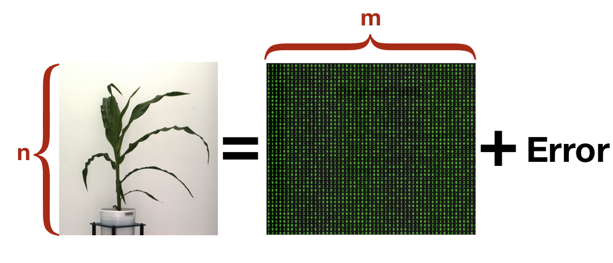
- $n$: number of individuals (records)

- $m$ number of SNPs (genetic markers)


---
# Quantitative Genetics
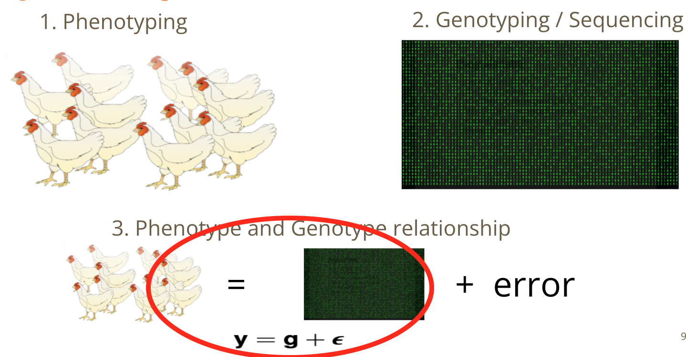


---
# How to integrate high-dimensional time series data?
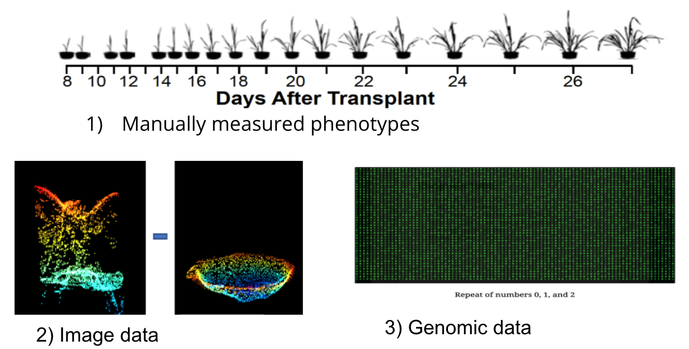


---
# 1. Time series analysis using image-derived phenotypes
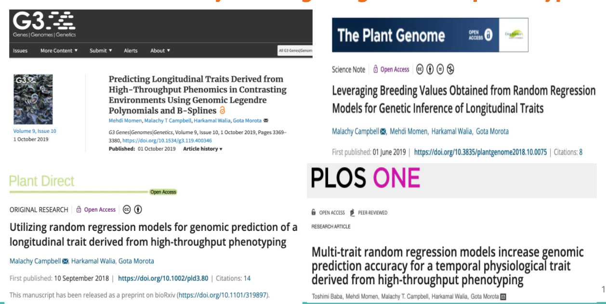

---
# 2. Network analysis of image-derived phenotypes
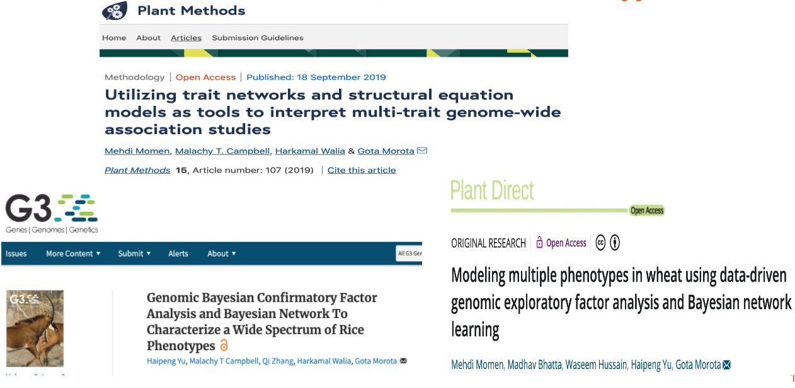


---
# Prediction vs. Inference
Complex traits are controlled by large number of genes with small effects, and  influenced by both genetics and environments

- Inference (location)
    - average effects of allele substitution

- Inference (variability)
   - variance component estimation
   - genomic heritability
  
Combination of above two (e.g., estimate proportion of additive genetic variance explained by QTLs)

- Prediction 
    - genomic selection
    - prediction of yet-to-be observed phenotypes


---
# Prediction vs. Inference 
<div align="center">

</div>

* [http://www.pnas.org/content/112/45/13892.abstract
](http://www.pnas.org/content/112/45/13892.abstract
)


---
# GWAS vs. Prediction

.right[[Wikimedia Commons](https://commons.wikimedia.org/wiki/File:Manhattan_Plot.png)]


