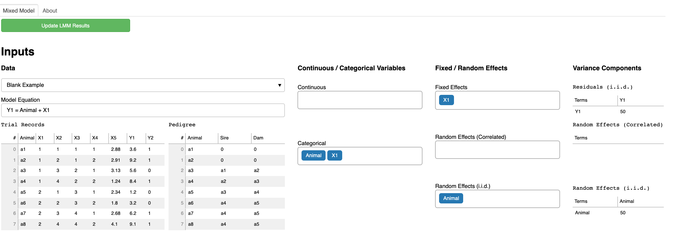
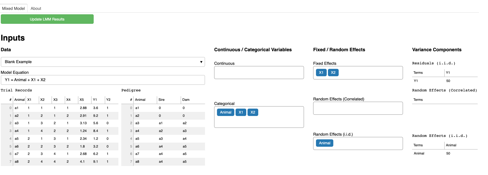
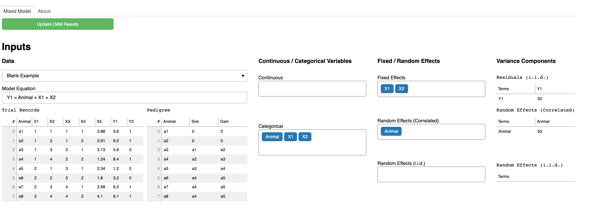
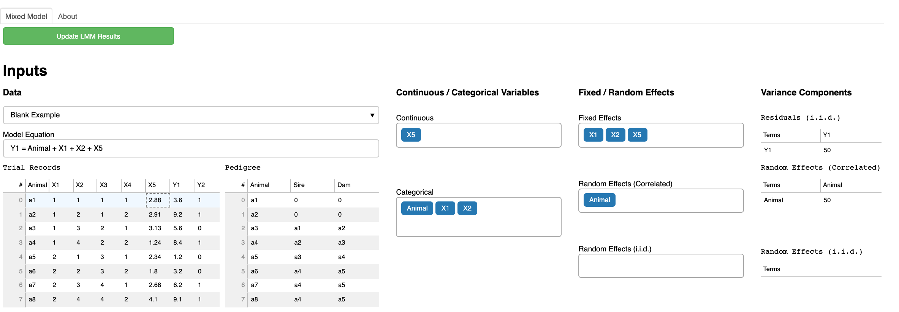

```{r knitr_init, echo=FALSE, cache=FALSE}
library(knitr)
library(rmdformats)

## Global options
options(max.print="75")
opts_chunk$set(echo=TRUE,
	             cache=TRUE,
               prompt=FALSE,
               tidy=TRUE,
               comment=NA,
               message=FALSE,
               warning=FALSE)
opts_knit$set(width=75)
```

## Background
This is the day 1 computer lab session for quantitative genetic analysis. The goal of this exercise is to understand mixed model equations (MME) using an interactive MME visualization tool  [LMMonBoard](https://lmmonboard.ucdavis.edu/myapp).


## Exercise 1
1. Select `Blank Example` from the `Data` drop-down list. 
2. In `Model equation`, remove `+ X2 + X5` so that you have `Y1 = Animal + X1`.
3. In the `Fixed / Random Effects` column, select `Animal` from the `Random Effects (i.i.d.)` drop-down list. 
4. Click `Update LMM Results` on the right upper corner. 



Assume that the residual variance $\sigma^2_e = 1$  and the additive genetic variance $\sigma^2_g = 1$. 

### Questions

- How many fixed effects are in the model? How many levels?
- How many random effects are in the model? How many levels?
- Interpret each component of MME. 


## Exercise 2
1. In `Model equation`, add `+ X2` so that you have `Y1 = Animal + X1 + X2`.
2. In the `Fixed / Random Effects` column, select `Animal` from the `Random Effects (i.i.d.)` drop-down list. 
3. Click `Update LMM Results` on the right upper corner. 



### Questions

- How many fixed effects are in the model? How many levels?
- How many random effects are in the model? How many levels?
- Interpret each component of MME. 


## Exercise 3
1. In the `Fixed / Random Effects` column, select `Animal` from the `Random Effects (Correlated)` drop-down list. 
2. Click `Update LMM Results` on the right upper corner. 



### Questions

- How many fixed effects are in the model? How many levels?
- How many random effects are in the model? How many levels?
- Interpret each component of MME. 


## Exercise 4
1. In `Model equation`, add `+ X5` so that you have `Y1 = Animal + X1 + X2 + X5`.
1. In the `Fixed / Random Effects` column, select `Animal` from the `Random Effects (Correlated)` drop-down list. 
1. In the `Continuous / Categorical Variables` column, select `X5` from the `Continuous` drop-down list. 
2. Click `Update LMM Results` on the right upper corner. 



### Questions

- How many fixed effects are in the model? How many levels?
- How many random effects are in the model? How many levels?
- Interpret each component of MME. 


